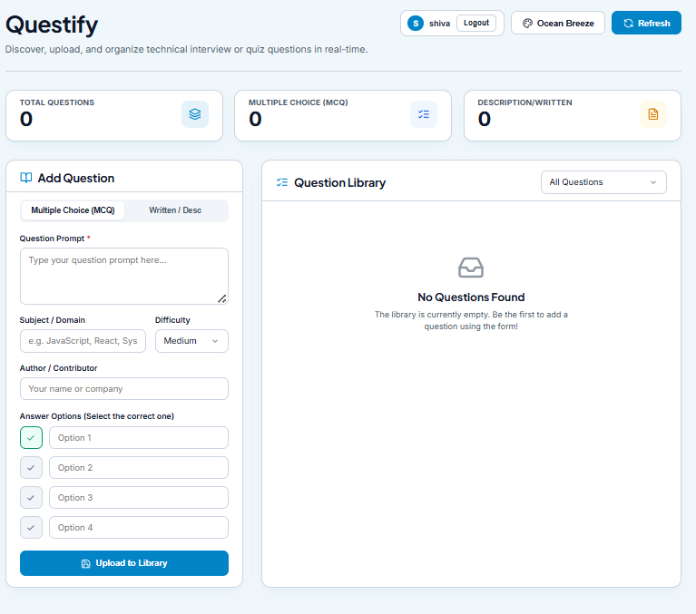
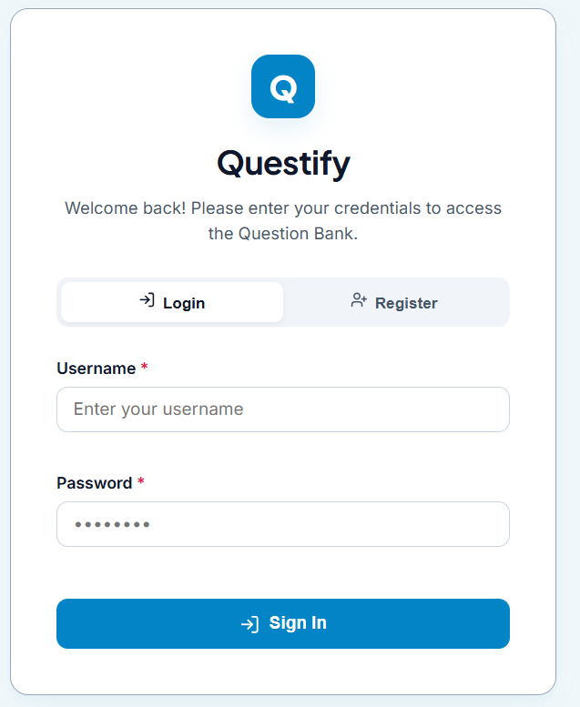
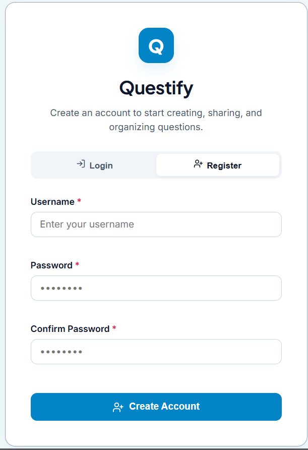

# Questify 📚

Questify is a modern, real-time question bank platform designed to help developers, educators, and students discover, upload, and organize technical interview or quiz questions.

## 🚀 Live Demo & Deployments
- **Backend API:** [https://questify-eight-sooty.vercel.app](https://questify-eight-sooty.vercel.app)
- **Frontend App:** [https://questify-p7uh.vercel.app](https://questify-p7uh.vercel.app)

---

## 📸 Screenshots

Here are some previews of the Questify interface:

### 1. Main Dashboard


### 2. Authentication (Sign In & Register)
| Sign In | Register |
|---------|----------|
|  |  |

---

## ✨ Features

- **🔒 Secure Authentication:** JWT-based user login and registration system.
- **📝 Add & Edit Questions:** Support for Multiple Choice Questions (MCQs) and written description/long-answer questions.
- **🏷️ Metadata & Categorization:** Tag questions with subject/domain, author, and difficulty level (*Easy*, *Medium*, *Hard*).
- **🎨 Dynamic Themes:** Choose from premium custom themes (e.g., *Ocean Breeze*).
- **⚡ Real-time Search & Filtering:** Instantly filter question list by category or difficulty.
- **🌐 Robust API Integration:** Seamless connection between Vite client and Express/MongoDB server.

---

## 🛠️ Tech Stack

### Frontend
- **Framework:** React 19 (Vite)
- **Styling:** Custom Vanilla CSS with responsive design system
- **Icons:** Lucide React

### Backend
- **Framework:** Node.js with Express
- **Database:** MongoDB (via Mongoose ODM)
- **CORS:** Dynamic CORS configuration for local & production origins
- **Deployment:** Vercel Serverless Functions

---

## ⚙️ Installation & Local Setup

To run Questify locally on your machine, follow these steps:

### Prerequisites
- Node.js (v18 or higher recommended)
- MongoDB database (local or Atlas cluster)

### 1. Clone the Repository
```bash
git clone https://github.com/your-username/Question-Bank.git
cd Question-Bank
```

### 2. Backend Setup
1. Navigate to the `server` directory:
   ```bash
   cd server
   ```
2. Install dependencies:
   ```bash
   npm install
   ```
3. Create a `.env` file in the `server` root and configure your environment variables:
   ```env
   PORT=5000
   MONGODB_URI=your_mongodb_connection_string
   CLIENT_ORIGIN=http://localhost:5173
   ```
4. Start the server in development mode:
   ```bash
   npm run dev
   ```

### 3. Frontend Setup
1. Navigate to the `client` directory:
   ```bash
   cd ../client
   ```
2. Install dependencies:
   ```bash
   npm install
   ```
3. Create a `.env` file in the `client` root and configure the API endpoint:
   ```env
   VITE_API_URL=http://localhost:5000/api
   ```
4. Start the local Vite development server:
   ```bash
   npm run dev
   ```

---

## 📦 Production Deployment

### Backend (Vercel)
The backend is configured to run as a serverless function on Vercel using `server/vercel.json`:
1. Move to the `server/` directory.
2. Deploy using the Vercel CLI:
   ```bash
   vercel --prod
   ```

### Frontend (Vercel)
1. Set up the production `VITE_API_URL` environment variable pointing to your deployed backend (e.g. `https://questify-eight-sooty.vercel.app/api`).
2. Build the project:
   ```bash
   npm run build
   ```
3. Deploy the `dist` directory to Vercel.
